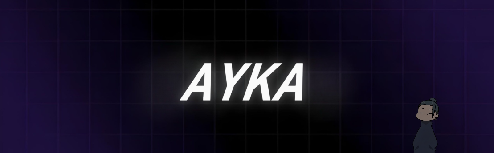

<a href="https://github.com/ayka-667"></a>
<a href="https://nekohost.fr/invite"></a>

```
📬 Contact Me

- Email : contact@ayka.dev
- Discord  : nekohost.fr/invite

🌐 Life Snapshot

- Languages Spoken: 
  - French
  - English

💻 Coding Expertise

- Languages:
  - Expert: 
    - Python
    - HTML & CSS
    - JavaScript
  - Intermediate:
    - Php
    - Lua
  - Learning:
    - GO
    - C++

🛠️ Specialties

- Task Automation
- Artificial Intelligence
- Website development

🖥️ My Beastly Setup

- PC Build:
  - Processor : AMD Ryzen 5 3600 | 6-Cores
  - RAM       : 16GB DDR5
  - GPU       : NVIDIA RTX 2070 | 8GB
  - Storage   : 1TB Sata SSD (OS) + 3TB HDD (Storage)
  - Cooling   : Air cooler
  - Monitor   : 3x 1080p Monitors

🔧 Development Environment

- IDE:
  - Visual Studio Code
  - VS Code 2022

- Operating Systems:
  - Linux: Zorin OS 17.2
  - Windows 11
  - Servers: Debian GNU/Linux 12 (bookworm) / Ubuntu 24.04.1 LTS

🚀 Projects

- Nekohost
- Kaya Bot

- Im working on:
  - Check out my repositories to see what I'm working on!
```
<br>
<h2 align="center">Skills </h2>
<p align="center">
  <a href="https://skillicons.dev">
    
  </a>
</p>
<br>

<p align="center">
  
</p>

<h2 align="center">Discord </h2>

<p align="center">
  <a href="https://discord.com/users/601337312714031124">
    
  </a>
</p>
